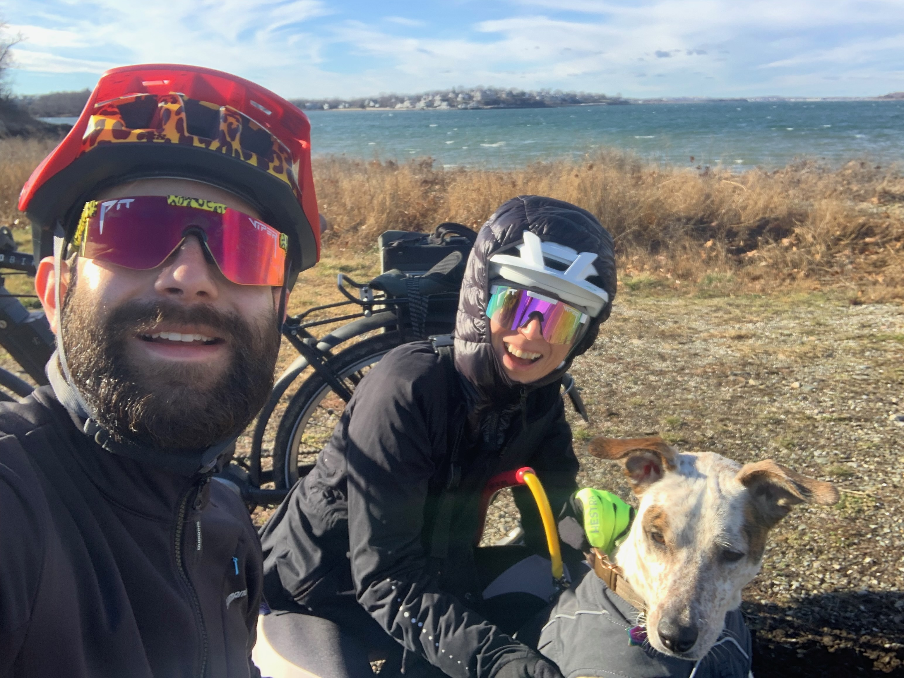

# Mauricio Tec

I am a postdoctoral fellow at Harvard University working on improving the applicability of reinforcement learning (RL) and AI-driven decision-making in real-world applications. I'm also interested in robotics 🤖 and food 🍣.


<!--  -->

<!-- ::::{grid}
:::{grid-item-card}
:link: about
More about me ℹ️
::: -->
<!-- :::{grid-item-card}
:link: projects
Projects I've worked on 🔧
:::
:::{grid-item-card}
:link: blog
My blog 📝  
::: -->
<!-- :::: -->


### Education

* Ph.D. in Statistics, The University of Texas at Austin, USA, 2022
* M.S. in Mathematics, University of Cambridge, UK, 2015
* B.S. in Applied Mathematics, ITAM, MX, 2013

### Experience
* Harvard University, Postdoctoral Fellow, 2022 - present
* Facebook AI Research, Research Intern, 2020
* Intel AI, Research Intern, 2019
* Graduate Research Assistant, The University of Texas at Austin, 2018 - 2021

### CV

* You can download a reasonable update <a href="_static/cv.pdf" target="_blank"> ⬇ here</a>. *Last updated:* 2024-01-16.


* You can also try my [🤖 LIVE CV](https://mauriciogtec-live-cv.streamlit.app), powered by AI. Have fun asking your own questions.
  


### My Family




### News

- **[2024-01-16]** 🔥 New paper: [SpaCE](https://arxiv.org/pdf/2312.00710.pdf) paper has been accepted to ICLR 2024. See you in Vienna!

- **[2024-01-15]** 🤖 Created a [LIVE CV](https://mauriciogtec-live-cv.streamlit.app), powered by retrieval augmented generation. Have fun asking your own questions about my research and work experience.

- **[2023-12-10]** Started this new website based on [Chris Holdgraf's new blog template](https://chrisholdgraf.com/blog/2020/sphinx-blogging/).

- **[2023-10-01]** New ArXiV paper (full version) [*SpaCE: The Spatial Confounding Paper*](https://arxiv.org/pdf/2312.00710.pdf).

- **[2023-09-01]** Promoted to Research Associate at Harvard University. I will continue my research as usual but take on more projects in a senior role and propose grant applications.
  
- **[2023-05-15]** New grant as Co-PI awarded by the [Harvard Chan-NIEHS](https://www.hsph.harvard.edu/niehs/) to develop new deep learning architectures for projecting climate change's health impacts, combining causal inference with computer vision and graph neural networks. The associated paper [*Projecting the climate penalty on pm2.5 pollution with spatial deep learning*](https://www.climatechange.ai/papers/iclr2023/63) has been accepted for a poster presentation at the TCCML workshop at ICLR 2023.
  
- **[2023-03-01]** New ArXiV paper [*Causal Estimation of Exposure Shifts with Neural networks*](https://arxiv.org/pdf/2302.02560.pdf).

- **[2022-08-15]** Started a postdoc at Harvard University, Department of Biostatistics, focusing on novel AI/ML methods with applications in climate and health.

- **[2023-01-20]** Our paper [Bayesian Nonparametric Adjustment of Confounding](https://onlinelibrary.wiley.com/doi/abs/10.1111/biom.13833) has been accepted for publication at Biometrics.
  
- **[2022-08-15]** Started a postdoc at Harvard University, Department of Biostatistics, focusing on novel AI/ML methods with applications in climate and health.
  

<!-- 
```{toctree}
:maxdepth: 2
:hidden:
livecv
```-->

