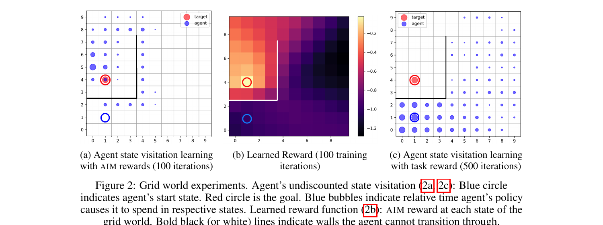

# Adversarial Intrinsic Motivation

:::::{div} terminal-window
:::{div} terminal-titlebar
:::
::::{div} terminal-body

`$ cat projects/adversarial-intrinsic-motivation.md`

:::{div} terminal-output

**Adversarial Intrinsic Motivation**

RL agents are lazy explorers. Without dense rewards, they tend to stay close to where they started. Goal-conditioned RL makes this worse — the agent needs to reach arbitrary goals in state space, but the extrinsic reward is sparse and uninformative until you're basically already there.

This project builds an intrinsic reward based on the Wasserstein-1 distance between where the agent is visiting and where it should be visiting. The key property: unlike most learned distance functions, this one changes smoothly with MDP transitions. That means the reward signal doesn't vanish or explode as the agent moves through state space — it always points in a useful direction.

Paired with Hindsight Experience Replay, it makes goal-conditioned agents learn significantly faster on simulated robotics tasks. The insight generalizes: if you can build a distance function that respects the topology of your MDP, exploration gets a lot easier. NeurIPS 2021.

:::

`$ cat /etc/motd`

:::{div} terminal-output
*// ...built with Claude Code. based on data, but verify.*
:::

`$ cd ~`

:::{div} terminal-output
[learn more](https://arxiv.org/abs/2105.13345) · [back to home](../index)
:::

::::
:::::
