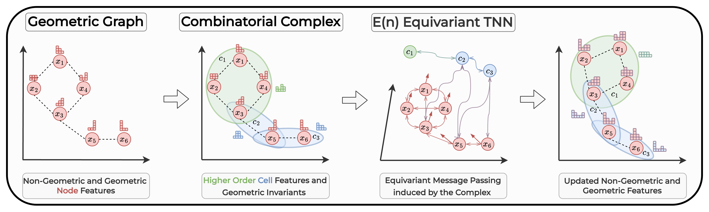

# Equivariant Topological Neural Networks

:::::{div} terminal-window
:::{div} terminal-titlebar
:::
::::{div} terminal-body

`$ cat projects/equivariant-topo-nn.md`

:::{div} terminal-output

**E(n) Equivariant Topological Neural Networks**

Most graph neural networks see the world as nodes and edges. But molecules have rings. Social networks have cliques. Meshes have faces. Pairwise connections miss the structure that actually matters.

Topological neural networks operate on *combinatorial complexes* — a unified structure that captures graphs, hypergraphs, and cell complexes in one framework. This project adds geometric equivariance: the network's predictions don't change if you rotate or translate the input. That's a free lunch for any 3D task — you get invariance without data augmentation.

The architecture computes geometric invariants (distances, angles) from the complex, then passes them through equivariant message passing layers. On molecular property prediction (QM9) and air pollution estimation, it matches or beats models that use significantly more compute. ICLR 2025.

The broader bet: higher-order structure + geometric symmetry is the right inductive bias for a lot of scientific ML. We're only scratching the surface.

:::

`$ cd ~`

:::{div} terminal-output
[read the paper](https://arxiv.org/abs/2405.15429) · [back to home](../index)
:::

::::
:::::
