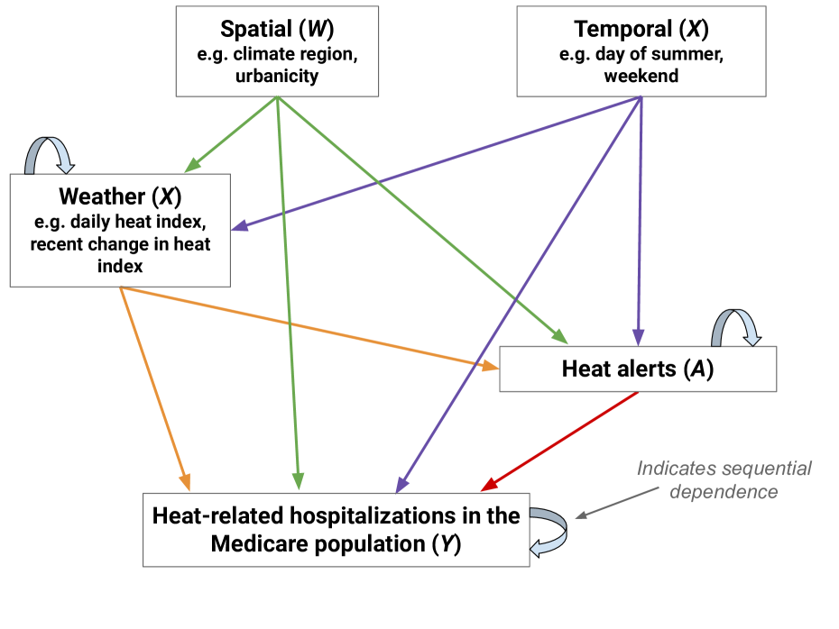

# Heat Alert Optimization

:::::{div} terminal-window
:::{div} terminal-titlebar
:::
::::{div} terminal-body

`$ cat projects/heat-alerts.md`

:::{div} terminal-output

**Optimizing Heat Alert Issuance with RL**

Cities issue heat alerts to protect vulnerable people. The problem: they issue them based on fixed temperature thresholds. That's a blunt instrument when what actually matters is a complex interaction of weather, demographics, historical exposure, and alert fatigue.

This project reframes heat alert issuance as an RL problem. The environment is built from real data — 15 years of daily weather, Medicare hospitalization records, and county-level demographics across 2,500+ US counties. The reward model is Bayesian, because the causal signal is noisy and heterogeneous across locations.

The first surprise: unconstrained RL fails hard. It either never alerts or always alerts. The fix is constraint-based — budget the number of alerts per season and let the policy learn *when* they matter most. The constrained policy outperforms the National Weather Service's current approach.

This is RL applied to real public health infrastructure, not a simulated benchmark. The kind of problem where getting the reward function right matters more than the algorithm. AAAI 2025.

:::

`$ cd ~`

:::{div} terminal-output
[read the paper](https://arxiv.org/abs/2312.14196) · [back to home](../index)
:::

::::
:::::
