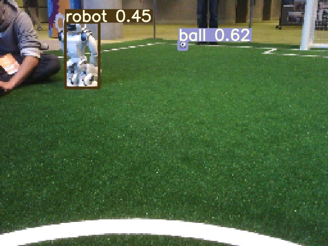
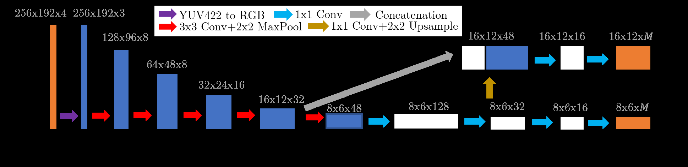

# Robot Soccer Vision

:::::{div} terminal-window
:::{div} terminal-titlebar
:::
::::{div} terminal-body

`$ cat projects/robot-soccer-vision.md`

:::{div} terminal-output

**Real-Time Vision for Autonomous Robot Soccer**

Five Aldebaran NAO robots per side. An Intel Atom E3845 CPU with 4GB of RAM. No cloud, no GPU worth mentioning, and a 33ms budget per frame — because the perception loop shares time with motion, localization, and coordination. That's the hardware constraint in the RoboCup Standard Platform League.

We built an end-to-end object detection pipeline that runs at 35 Hz on this hardware. The key was aggressive architecture search: we benchmarked YOLO and SSD variants, stripping them down to micro-scale networks (xYOLO-pico, xYOLO-nano) and running inference through TFLite with XNNPack optimizations. The top camera runs a full multi-class detector (ball, robots, crosses) at 98.7% mAP; the bottom camera runs a stripped variant at 80x80 resolution.

We also built the data pipeline from scratch — annotating thousands of frames from competition logs using CVAT, with Efficient-Det D7 providing seed labels to speed up manual annotation. Three datasets, mosaic augmentation, photometric transforms for lighting robustness.

UT Austin Villa placed top-5 twice at the international competition. This project shaped how I think about deploying AI: if it can't run in real time on bad hardware under adversarial conditions, it doesn't ship.

:::

`$ cd ~`

:::{div} terminal-output
[read the paper](https://www.cs.utexas.edu/~pstone/Papers/bib2html-links/RoboCup2022-nskiran.pdf) · [back to home](../index)
:::

::::
:::::
