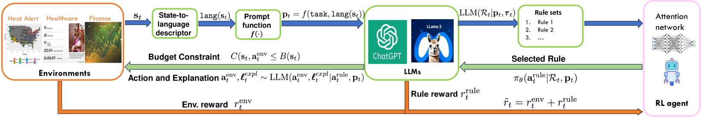

# Rule-Bottleneck RL

:::::{div} terminal-window
:::{div} terminal-titlebar
:::
::::{div} terminal-body

`$ cat projects/rule-bottleneck-rl.md`

:::{div} terminal-output

**Rule-Bottleneck RL**

The black-box problem in RL is real. You train a policy, it works, and nobody — including you — can tell you why. That's fine for games. It's not fine when you're allocating hospital beds or deciding who gets a ventilator.

This project forces interpretability into the RL loop without sacrificing performance. The idea: an LLM generates a set of human-readable decision rules at each step. An RL policy — a small attention network — picks which rule to follow. Then chain-of-thought reasoning executes the action. The bottleneck is the rule selection: the agent *has* to route through something a human can read.

The surprising part? It matches deep RL on resource allocation and clinical monitoring tasks. Turns out you don't always need a 100M-parameter black box. Sometimes a good rule, selected by a learned policy, is enough.

This is the kind of RL I'm most excited about — agents that can explain what they're doing and why, in real time, in high-stakes settings.

:::

`$ cd ~`

:::{div} terminal-output
[read the paper](https://arxiv.org/abs/2502.10732) · [back to home](../index)
:::

::::
:::::
