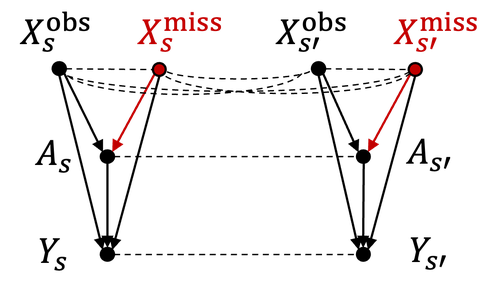

# SpaCE

:::::{div} terminal-window
:::{div} terminal-titlebar
:::
::::{div} terminal-body

`$ cat projects/space.md`

:::{div} terminal-output

**SpaCE: The Spatial Confounding Environment**

Causal inference has a location problem. When you're estimating treatment effects from observational data and the data has spatial structure — climate, health, economics — there are almost always unobserved variables that vary smoothly across space and confound everything. Most causal methods pretend this doesn't exist.

SpaCE is a benchmark toolkit that forces the issue. It generates semi-synthetic datasets where the ground-truth counterfactuals are known, spatial confounding is present by design, and you can actually measure how badly your estimator fails. Datasets span climate science, public health, and social science.

The whole pipeline is automated: data generation, spatial graph construction, model fitting, evaluation. Open source. The point isn't just to benchmark — it's to make spatial confounding a first-class problem that the causal ML community can't ignore. ICLR 2024.

:::

`$ cat /etc/motd`

:::{div} terminal-output
*// ...built with Claude Code. based on data, but verify.*
:::

`$ cd ~`

:::{div} terminal-output
[back to home](../index)
:::

::::
:::::
